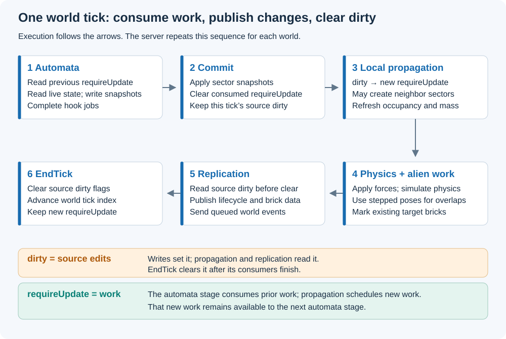

# Tick and dirty propagation

Status: Current implementation. Checked against Caelix `253d632` and Core
`e5ead50` on 2026-09-06.

A tick consumes scheduled voxel work, commits changes, runs physics, and publishes
replication. Dirty propagation schedules affected bricks for further work.
Understanding the two flag sets is necessary before adding an automaton or a
consumer of voxel changes.

## The two flag sets

| State | Meaning | Typical reader |
|---|---|---|
| `dirty` | This brick's source data changed during the current dirty lifetime. | Propagation and server replication. |
| `requireUpdate` | This brick needs work because propagation selected it. | Automata and other scheduled consumers. |

Writes through `SetBlock` / `SetVoxelSlot` mark source dirty flags. Propagation
combines those flags with neighborhood rules to mark target work. Reading raw
dirty flags after `EndTick` finds cleared flags, even when next-tick work exists.

## Current server order



*Figure 1. Follow the arrows across the top row and back along the bottom row.
Local propagation precedes physics; alien propagation uses the stepped poses.*

`CaelixServer.Step()` handles incoming messages, synchronizes world membership,
then processes each world in this order:

```text
TickSimulate
  fix the entity/body set for this tick
  begin automata writes on every entity with required work
  collect required brick positions and build the read context
  run automata hooks and complete their jobs
  end automata writes (commits the pending buffers)
  clear consumed requireUpdate flags
  propagate local dirty flags (may add neighboring sectors)
  refresh Block occupancy masks and body properties
  apply forces and simulate physics
  propagate alien influence using the stepped poses, if enabled
Replicate
  publish entity state and changed bricks; drain world events
EndTick
  clear raw dirty flags and advance the world tick index
```

Worlds share the server's clock. The current loop completes simulation,
replication, and end-of-tick work for one world before moving to the next world.

Local propagation runs before physics. Cross-entity (alien) propagation runs after
physics, using the overlap graph at the stepped poses. Alien propagation marks
existing target bricks with `MarkRequired` and must not allocate storage. During
local propagation, existing storage pointers must stay valid until its jobs finish.

## How to schedule and consume changes

1. Make a change through a world/sector setter at the appropriate boundary.
   Do not replace it with raw slot-memory writes that skip dirty bookkeeping.
2. Let the world run its propagation phases. Block writes generate the configured
   Block-change flags; other slot writes generate GeneralAutomata work.
3. In the next automata stage, consume `BricksRequiredUpdate` — a
   `NativeList<RequiredBrick>` keyed by BRICK KEY — and read through
   `AutomataReadContext`: `ctx.OpenBrick(brick)` gives an `AutomataBrick` and
   `ctx.CreateReader(brick, access)` an alien-aware `AutomataReader`. Every
   coordinate is an ENTITY-LOCAL block position; writes stay inside the work brick.
4. Let the stage complete; `EndAutomataWrites` commits the pending buffers. Do not
   clear flags inside a hook.

For a newly written entity with no prior required flags, the first server step
propagates its initial dirty state. Its automata work becomes available on the
following step. The first step can already replicate the written Block data.
Tests or examples expecting automata to run must account for this scheduling delay.

During the voxel stage, keep entity creation/removal, static-state changes, and
transform changes outside the hook. The stage's entity set and lookup context
have already been prepared. Local rules normally communicate through the
26-neighbor Moore neighborhood at roughly one voxel per tick. Whole-entity motion
is handled by physics and alien propagation rather than that local propagation limit.

## Clock and pause behavior

When `BlockEncoding.PackedSceneColor` is compiled on, `CaelixWorld` skips all
registered automata hooks. Packed scene materials do not represent gameplay block
IDs. The automata write phase, dirty propagation, physics and replication still run, so
loading scenes and applying edits continue to update the client. This is owned by
the engine world and applies to Titania hooks too; it is not a runtime setting.

`CaelixHost.FixedUpdate` pushes settings and calls `Server.Tick()`. `Tick()` honors
`Frozen` after the first tick. Its initial frozen tick publishes initial state but
leaves edit commands queued. An explicit `Step()` consumes queued edits and runs
one tick even while frozen. `host.Step()` first pushes the host's settings.

`CaelixHost.Update` calls `Server.ProcessQueries()` so read-only queries work when
there is no fixed step, including `Time.timeScale == 0`. Query handlers must not
mutate state. For a custom loop, choose one clock driver: fixed-step `Tick()` or
the accumulator-based `Server.Update(deltaTime)`.

## Client order

The host calls `Client.Receive()` to clear old frame work and apply incoming
messages, then `PrepareRender()` to propagate Geometry work. Renderers consume
the replica before `EndFrame()`. The client runs no automata or physics.
Several server ticks can arrive before one client frame.

## Implementation and checks

- [World tick](../../Runtime/Simulation/CaelixWorld.cs): `TickSimulate`, `EndTick`
- [Server driver](../../Runtime/Simulation/CaelixServer.cs): `Tick`, `Step`, `ProcessQueries`
- [Host frame](../../Runtime/Client/CaelixHost.cs): `FixedUpdate`, `Update`
- [Brick collection](../../Runtime/Simulation/Utils/CollectBrickJob.cs)
- [Core enumerators and current collector limitation](https://github.com/betairylia/Caelix-Core/blob/main/Documentation~/reference/enumerators.md)
- [Replication tests](../../Tests/Editor/ReplicationTests.cs), [Core propagation scenarios](https://github.com/betairylia/Caelix-Core/blob/main/Tests/Editor/DirtyPropagationScenarioTests.cs)

These phases were reviewed from source. Unity tests were not rerun for this page.
