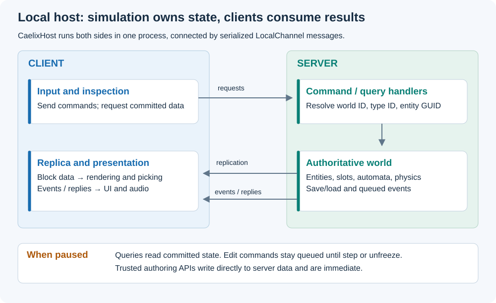

# Use the server and client

Status: Current implementation and integration guidance. Checked against Caelix
`253d632` and Core `e5ead50` on 2026-09-06.
Component API cleanup reviewed against the working tree after Caelix checkpoint
`69c54a7`; the rest of this page retains the review baseline above.

Use the server as the owner of simulation and persistent state. Use the client
replica for rendering and interactive tools. A local game uses these same roles
inside one process through `CaelixHost` and `LocalChannel`.

## Responsibilities



*Figure 1. The local host uses serialized messages between simulation and its
client replica. Queries can complete while edit commands remain queued during pause.*

| Object | Owns or does |
|---|---|
| `CaelixServer` | Worlds, connections, clock, command/query dispatch, replication. |
| `CaelixWorld` | Authoritative entities, slots, bodies, automata, physics, save/load, queued events. |
| `CaelixClient` / `ClientWorld` | Received world state and views, commands, query callbacks, event callbacks. |
| `CaelixHost` | Unity lifecycle and local server/client setup; one process host. |
| `VoxelEntity` | Scene authoring and a client view binding to an entity GUID. |
| `VoxelBody` | Scene-authored body registration, solver settings, and force command convenience methods. |

```text
Tool input -> Client command -> Server handler -> World mutation
                                                |
                                      tick and replication
                                                |
Renderer <- Client replica <---------------------+
UI/audio <- Client event callback <--- World event
```

The default replicated slot mask includes Block. A client therefore need not
have server-only slot data. Use a query when a tool needs committed server data
outside its replica. World ID `0` is valid; `NetHeader.NoWorld` (`0xFFFF`) is the
sentinel for messages such as the handshake.

## Build a voxel sandbox

1. Create the host and configure its renderer and input tools.
2. Use `host.Client.SpawnEntity` for runtime entity creation, then `SetBlock` or
   your registered commands for edits. A chosen nonzero GUID lets later commands
   address the entity before the spawn has been replicated back.
3. Read the client replica for immediate picking and rendering. Use `QueryVoxel`
   or a typed query for server-only information.
4. Apply game validation in server command handlers, then mutate through world
   methods. Use events for UI/audio reactions that accompany accepted actions.
5. Let the host drive ticks and receive frames. When paused, explicitly step to
   apply queued edits. Queries continue to inspect committed state.

For save/load, call `host.Save(path)` / `host.Load(path)` as explicit server
operations. Load replaces the entities named by the file and retains unrelated
live entities. It is not a queued client edit. Reacquire data after replacement;
a persistent GUID does not mean the underlying allocation is unchanged.

## Author a traditional game with voxel objects

For a “Unity, but voxel” workflow, place `VoxelEntity` components and authoring
tools in scenes. Keep each entity at scale 1 and attach `VoxelBody` where the
object requires voxel physics. Configure static/moving state deliberately.
The component registers its authored entity with the host and binds to the
replicated view when it arrives.

In local Host mode, `VoxelEntity`'s data API writes directly to server storage.
That is useful for trusted importers and generators. These writes are immediate
and bypass the queued-client pause behavior. For player interactions that must
obey stepping and server validation, use `host.Client` commands even in a local game.

`VoxelBody` is an authoring component; replicated objects carry body presence in
`EntityView.HasBody` and do not receive a `VoxelBody` component. It has no
mass-computation, body-record copy, direct velocity, or drag API. Its `AddForce`,
`AddTorque`, and `AddForceAtPosition` convenience methods enqueue client commands
for the server's next step.
The server tick derives mass, center of mass, inertia, and `PhysicsInfo` after voxel
edits and before applying forces. Use `client.AddForce` with
`VoxelBodyForceCommand.Force`, `Torque`, or `ForceAtPosition`, and
`client.SetDrag` / `ReleaseDrag` for client input. Server code can inspect `world.TryGetBody`
and change velocity through `world.SetBodyVelocity`.

`VoxelEntity` keeps the host authoring helpers used by importers and generators,
including slot/sector writes and allocated-brick refresh. Its unused record-copy,
dirty-clear, voxel-collection, and explicit transform-sync wrappers have been
removed. Server systems use `CaelixWorld` and `VoxelEntityData`; presentation reads
`EntityView.Data`. The server owns simulation propagation and dirty lifetimes;
`ClientWorld` owns the Geometry work needed by renderers.

`BodyProperties_UpdateOnServerTicksWithoutClientFrames` checks mass/inertia updates
before any client frame, the absence of client `PhysicsInfo` storage and body
components, and replicated body add/remove state.
`AuthoredBody_ClientForcesWaitForServerStep` checks queued client forces and
authored body removal. These are local Host checks.
All 271 EditMode tests passed with this cleanup on 2026-09-06 using Unity
6000.5.6f1 in the isolated Titania project.
After restoring the component force wrappers, all 51 targeted lifecycle, Host,
replication, meshing, and channel tests passed; the Host test calls `VoxelBody.AddForce`.

Keep presentation behavior on the Unity side, and resolve simulation targets by
world ID and entity GUID. Use [registered events](commands-and-events.md) to trigger
audio/UI after server decisions. Avoid retaining a raw sector pointer in a
MonoBehaviour across reloads or despawns.

## Custom loops and current scope

The [getting-started example](get-started.md) shows explicit server/client setup.
A custom fixed-step loop calls `server.Tick()`; a loop without its own fixed
step can call `server.Update(deltaTime)`. Pump queries on frames without simulation
if tools need paused inspection. Receive and prepare the client before rendering,
then call `EndFrame`.

The implemented transport is the in-process `LocalChannel`. A separate remote
client/server bootstrap and production multiplayer transport are future work.
Registry hashes detect some mismatches but are not schema negotiation; the
current handshake logs a mismatch rather than enforcing disconnect. The recorded
validation covers trusted local ordered delivery. Treat remote authorization,
untrusted payload validation, backpressure, and query timeouts as additional work
before exposing a network service.

## Related implementation

- [Detailed architecture contract](../internals/SERVER_CLIENT_ARCHITECTURE.md)
- [Host](../../Runtime/Client/CaelixHost.cs), [entity authoring/view](../../Runtime/Client/VoxelEntity.cs)
- [Server](../../Runtime/Simulation/CaelixServer.cs), [client](../../Runtime/Client/CaelixClient.cs)
- [Lifecycle and pause tests](../../Tests/Editor/ReplicationTests.cs)
- [Dated validation and limits](../archive/validation/RND_VALIDATION.md)
